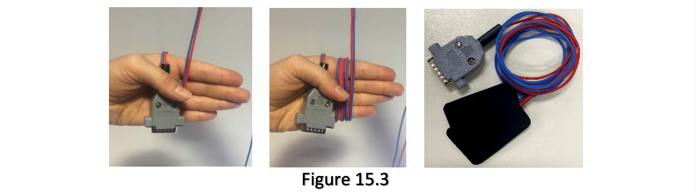

## BrightStim Self-Administration Manual

Epworth Centre for Innovation in Mental Health (ECIMH)

## Simplified Treatment Checklist

1.  Saline on sponges – 6mL on each side (12mL per sponge in total).

2.  Insert sponges over white clip forks.

3.  Insert electrodes into each sponge (Red lead -> red clip / blue lead
    -> blue clip).

4.  Place cap on head – ensure correct placement of cap as per
    instructions

5.  Start treatment.

6.  Relax for 30 minutes – follow guidelines.

## Guidelines for Treatment

During treatment, you want your brain activity to be ‘neutral’, meaning
you want to be relaxed but alert. It is important that you do not
participate in any activities that require mental effort as this can
prevent the treatment from having long-lasting effects on your memory
and thinking abilities.

| Acceptable activities | Why?                             |
|-----------------------|----------------------------------|
| Sitting / laying down | It doesn’t require mental effort |
| Light TV/podcast      | It doesn’t require mental effort |

| Activities to avoid                             | Why?                                                                                       |
|-------------------------------------------------|--------------------------------------------------------------------------------------------|
| Drinking coffee/tea before treatment            | Coffee stimulates the brain, interfering with the effects of tACS                          |
| Reading                                         | It may activate parts of the brain we are targeting.                                       |
| Using the computer or mobile phone              | It may activate parts of the brain we are targeting.                                       |
| Talking to people for extensive periods of time | It may activate parts of the brain we are targeting.                                       |
| Physical activity (e.g. gardening, cleaning)    | It may activate different parts of the brain we are targeting and impact hormonal changes. |
| Sleeping / Meditating                           | It lowers brain activity to a minimal level which may counteract the stimulation’s effect. |

## Equipment Descriptions

The *BrightStim* home-kit includes the headset, yellow sponges, two
electrodes connected to leads, *Brightstim* device, kidney dish,
alcohol swabs, bottled saline, needleless syringe and a clear plastic
container.  Each item is important for a different stage of treatment
which is outlined in the step-by-step user-manual.

| Equipment                             | Picture                | Description                                                                                                                                               |
|---------------------------------------|------------------------|-----------------------------------------------------------------------------------------------------------------------------------------------------------|
| Headset:                              |   | Used to secure the electrodes in the correct location and ensures that the electrodes are in close contact with your scalp for optimal brain stimulation. |
| Yellow sponges:                       |   | Used to connect the rubber electrodes to the Bright-Stim device.                                                                                          |
| Rubber electrodes connected to leads: |   | Used to deliver the stimulation produced by the Bright-Stim device.                                                                                       |
| *Brightstim* device:                  |   | Produces the stimulation                                                                                                                                  |
| Kidney dish:                          |   | Used to organise and hold required materials for stimulation so that they are in one location for easy access and use.                                    |
| Alcohol swabs:                        |   | Can be used to clean the electrodes and equipment after treatment                                                                                         |
| Saline:                               |   | Used to dampen the sponges so that they become soft and increase electrical conductivity of electrodes.                                                   |
| Needleless syringe:                   |  | Used to extract saline from inside the saline bottle.                                                                                                     |
| Clear plastic container:              |  | Used to collect saline in order to extract with the needleless syringe                                                                                    |

## *BrightStim* Device Button Diagram

## Prepare Home Environment

1. Place your *BrightStim* Kit on a table in a quiet and
  well-ventilated area of the house where you can be seated and
  unoccupied for approximately 40 minutes.

2. Open your *BrightStim* Kit and check that none of the items listed
  on the inventory list are missing. The items are listed above.

## Preparation of the Headset

3. Check the electrodes and electrode cables for signs of wear and
  tear.  **Please note: If equipment is damaged, contact the study
  coordinator and do not proceed with treatment.**

4. Prepare the Sponges:

    a Place the sponges in the kidney dish side-by-side:

     
	 
    b. Pour roughly 24ml of saline into the clear plastic container.

    c. Draw up 6mL of saline with the needless syringe (Figure
  4.2). **Please note: saline is the only option. Please do not use
  water.**
  
    
  
    d. Apply 6mL evenly to EACH side of the sponge in a zig-zag manner as
    shown in Figure 4.3 (12mL for each sponge in total).  
    **Please note:
    Ensure that the saline covers the dry areas of the sponge on each
    side.**

5. Place Sponges:

    a. Turn the swimming cap inside out, fold the cap in half and place it
  on a table surface so that the bottom of the cap is towards you and
  the clips are on the top (Figure 5.1).

    b. Place a sponge in front of each clip so that the closed sides are in
  left side and the open sides are on the right (Figure 5.2).

    

    c. Slide the sponges onto the forks of the clips. It helps to lift the
  fork of the clips up to give space for the sponge (Figure 5.3)

     

6. Insert Electrodes:

    a. Untwine the electrodes and leads and place them on a table.

     

    b. Place the BLUE lead electrode next to the BLUE clip.

    c. Place the RED lead electrode next to the RED clip.

     

    d. With the FLAT side of the electrode facing upwards towards the
  ceiling and away from the white clip, insert the BLUE lead electrode
  into the sponge of the corresponding BLUE clip and the RED lead
  electrode into the sponge corresponding RED clip (Figure 6.3).  **DO
  NOT put the electrodes under the white clips as this could impair
  stimulation/damage electrodes. Electrodes may fall out of the
  sponges from time to time. STILL do not clip down the electrodes.**

    

    e. Ensure that the BLUE leads and RED leads are facing the same direction
      when the cap is placed on the table.

     

## Applying the Headset

7. Apply the headset:

    a. Remove hair accessories so that hair hangs loosely. Earrings can
  stay in.  ** Any metal may cause problems with stimulation
  conductivity and potentially cause painful sensations to the scalp.**

    b. Hold the headset in front of your forehead (Figure 7.1) and place the
  front sponge (with RED lead) over your forehead (Figure 7.2).

    

    c. Hold the front of the headset against your forehead with one hand
  and pull the back of the headset backwards until it covers the head
  (Figure 7.3).

    

    d. When you have applied the headset as instructed above, using a nearby
    mirror, ensure the following (Figure 7.4):
  
    + The front edge of the cap sits just above your eyebrows.
  
    + Line up the centre of the cap (marked with a black line) to the
    midpoint between your eye brows.
  
    + The cap must cover your ears.
  
    + The cap must fit snuggly on your head.
  
    + Ensure the electrode leads are facing outward and away from your
    face.

        

    e. Hold the heads of the clips and firmly rub the scalp beneath in a
  circular motion for 10 seconds (Figure 7.5).  **To make sure that
  rubbing has not displaced the cap, recheck the previous
  instructions.**

     

## Connecting the Device
8. Place the *BrightStim*
device and GREY connector cord next to each-other and ensure the connecting
parts are properly aligned before putting together (Figure 8.1).

## Begin Treatment

9. Press the Power button and wait for the RED light to turn on.
     

10. 
    a. Wait for
      the greenstart stimulatio button to begin flashing. This
      indicates that the device is ready.

      Please note: You only have 10 seconds to begin stimulation when the green
    Start Stimulatio button starts flashing. After this the device
      powers down and you will need to undertake step 9 again.
      
    b. Press the greenstart stimulatio button to begin stimulation. The
      button will stop flashing and remain lit for the duration of the
      treatment.

## During Stimulation

11. Pause stimulation:

    If at any time, you need to stop the stimulation, press the yellowPause
stimulatio button. Stimulation will stop immediately, and the green
tart Stimulatio button will begin to flash.
**Please note: Device will begin to power down automatically if paused for longer
than 2 minutes.**

     

    Resume stimulation:

    To resume stimulation, press the greenstart stimulatio button.
The device enables 20 to 40 minutes of treatment per day. If the device is
paused, when resumed it will deliver the remaining treatment allowance for that
day.

    

## System error

12. IF the connection is poor between the electrodes and your scalp:
    TheCheck headse light will light up.
    
    SOLUTIONS: There are three things you can do to improve the
    electrode to scalp connection.
 

    1. Add another 6ml saline to sides of the sponges that make contact with
      your scalp (Figure 12.1).

        *Please note on your self-report form if you add more saline.

        *Ensure that the sponges are not too saturated that the saline is leaving the
    sponge. If this happens you could be connecting electrode to electrode, not
    electrode to scalp, in which case the treatment is not reaching your brain.
    

    2. Firmly rub the sponges to your scalp
    3. Check that the electrodes and leads are connected properly by pushing the
      leads into each hole firmly (Figure 12.2).

        Once you have completed these steps, undertake steps 9-10 again to begin
    treatment.

        **Please note: If thecheck headse lights up again, contact the study
coordinator (contact details are provided on the last page of this user-manual)**

## After Stimulation
13. Automatic device shut-down:

    The device will turn off automatically following the completion of treatment:

    a. The greenStart Stimulatio button will begin to flash.

     

    b. The yellowPause Stimulatio button will flash 3 times rapidly.

     

    c. The *BrightStim* device will then power down (2 minute duration).

    d. Wait
      until the power button light has turned off before
      removing the headset and disconnecting equipment. This is
      for safety purposes. If after 2 minutes the device is still on,
turn the device off at the power button.

    

### Forced device shut-down:
Please note: ONLY turn device off if it is absolutely necessary

+ Press the yellowPause Stimulatio button and wait for the green
     Start Stimulatio button to begin to flash.

+ Press the yellowPause Stimulatio button again and it will flash
      3-times rapidly.

+ The *BrightStim* device will then power down (2 minute duration).

+ NB: Wait until the power button light has turned off before removing the
      headset and disconnecting equipment. This is for safety purposes.

     **Please note: The device enables up to 60 minutes of treatment per
     day. If the device turns off after stimulation has been paused,
     follow steps 9-10 to resume the remaining time allocated for your
     daily treatment.**

## Remove Equipment

14. a. Remove the cap from your head (Figure 14.1)

    

    b. Remove the rubber electrodes from the sponges (Figure 14.2).

    

    c. Remove the sponges from the white clips attached to the headset and place
      the wet sponges in the kidney dish (Figure 14.3).

    

    d. Unplug the connecting lead from the *BrightStim* device (Figure 14.4).

    

## Equipment Cleaning

15. a. Rinse each sponge thoroughly using warm water to remove excess saline.

    b. Squeeze each sponge firmly to remove excess water and saline.

    c. Dry both sponges using a towel and leave to air dry over-night.

    d. Dry the kidney dish using a towel.

    

    e. Wipe the rubber electrodes with an alcohol swab. This is in important
      part of equipment maintenance. The electrodes can accumulate saline in
      ridges which may affect the delivery of the treatment (Figure 15.2).

    **DO NOT put water on the electrodes. Do not put under the tap or soak.**

    

    f. Wrap the electrodes with leads around your hand to prevent them from
      tangling (Figure 15.3) and put them in their plastic bag.

    

## Packing Up

16. a. Cover the *BrightStim* device in bubble wrap and insert to the small blue
      box
(Figure 16.1).

    

    b. Insert the box with the device and the plastic bag with electrodes to the
      pocket at the rear of the bag (Figure 16.2).

    

    c. Insert the cap with clips into the sealable plastic bag and put into the
      middle pocket of the bag with the saline bottle (Figure 16.3).

    

    d. Once sufficiently dry, insert all other equipment to the front pocket of
      the bag (Figure 16.4).

    

## Contact Details

In the event that you should experience any difficulties using this kit,
please refer to the following contact details of project coordinators
who can assist:

## Ms Prabhavi Perera

*Study Coordinator*

Epworth Centre for Innovation in Mental Health (ECIMH)

Phone: (03) 9805 4163

Email: magelage.perera@monash.edu

**<u>If you cannot get in contact with Ms Prabhavi Perera, you can
contact:</u>**

## Dr Sally Herring

*Research Manager and Study Co-investigator*

Epworth Centre for Innovation in Mental Health (ECIMH)

Phone: (03) 9805 4126

Email: sally.herring@epworth.org.au

## Dr Neil Bailey

*Post-Doctoral Fellow and Study Co-investigator*

Epworth Centre for Innovation in Mental Health (ECIMH)

Phone: (03) 9805 4367

Email: neil.bailey@monash.edu
