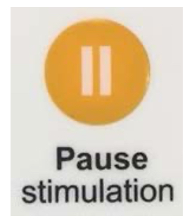

## During Stimulation

11. Pause stimulation:

    If at any time, you need to stop the stimulation, press the yellowPause
stimulatio button. Stimulation will stop immediately, and the green
tart Stimulatio button will begin to flash.
**Please note: Device will begin to power down automatically if paused for longer
than 2 minutes.**

     

    Resume stimulation:

    To resume stimulation, press the greenstart stimulatio button.
The device enables 20 to 40 minutes of treatment per day. If the device is
paused, when resumed it will deliver the remaining treatment allowance for that
day.

    

