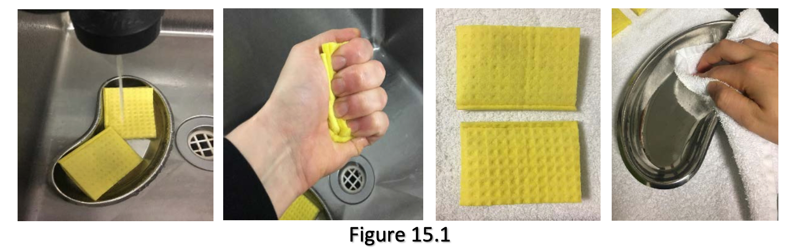
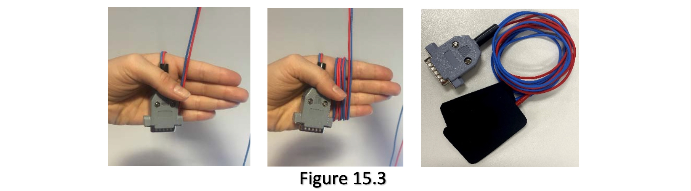

## Equipment Cleaning

15. a. Rinse each sponge thoroughly using warm water to remove excess saline.

    b. Squeeze each sponge firmly to remove excess water and saline.

    c. Dry both sponges using a towel and leave to air dry over-night.

    d. Dry the kidney dish using a towel.

    

    e. Wipe the rubber electrodes with an alcohol swab. This is in important
      part of equipment maintenance. The electrodes can accumulate saline in
      ridges which may affect the delivery of the treatment (Figure 15.2).

    **DO NOT put water on the electrodes. Do not put under the tap or soak.**

    

    f. Wrap the electrodes with leads around your hand to prevent them from
      tangling (Figure 15.3) and put them in their plastic bag.

    

